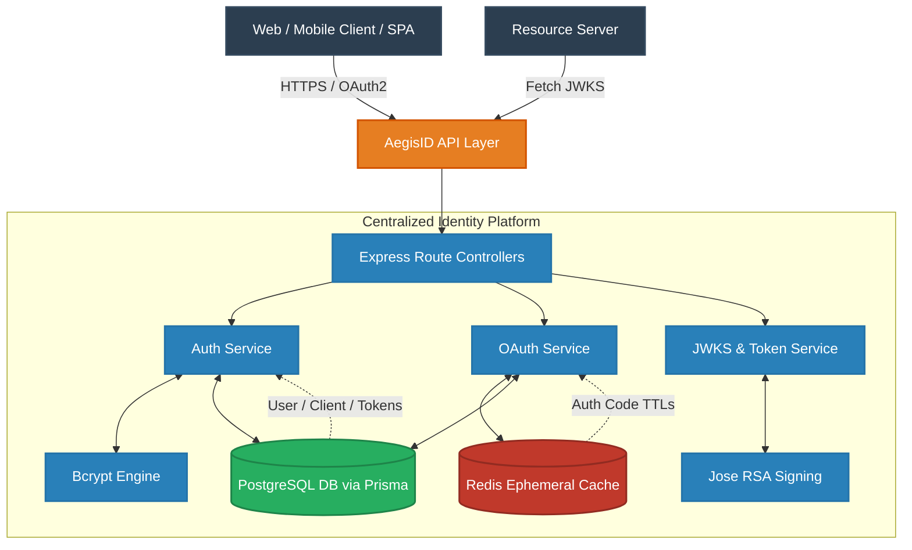
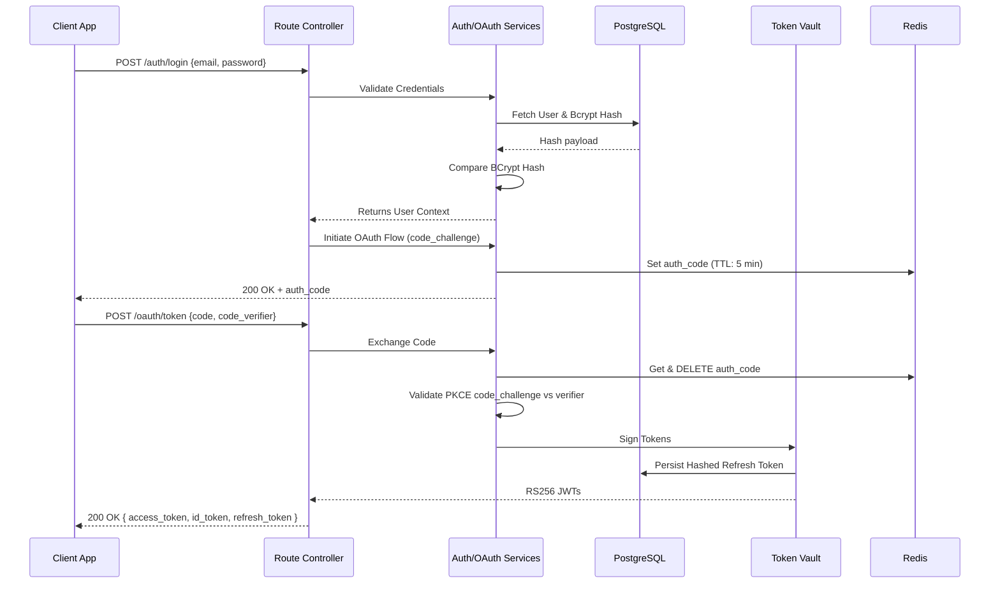
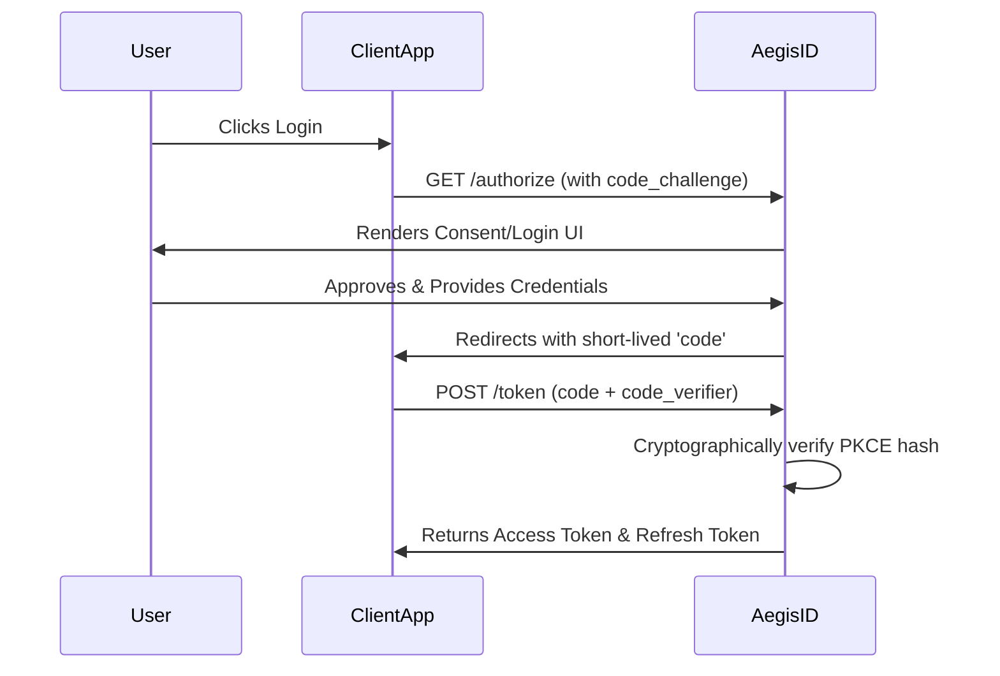
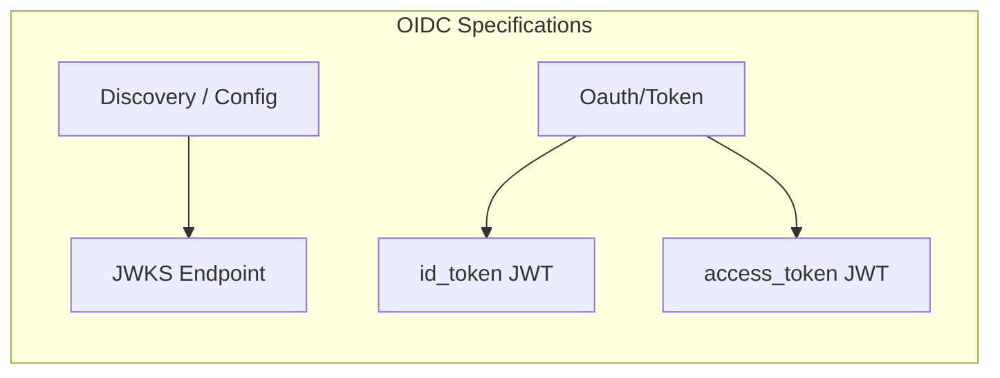
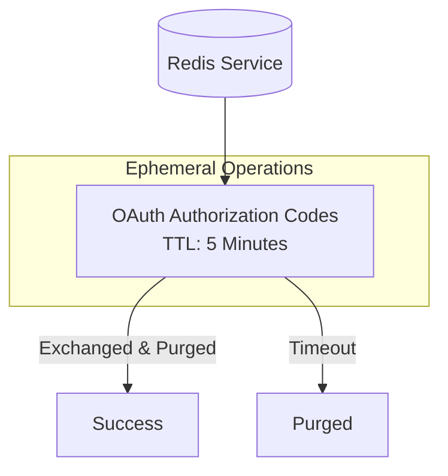
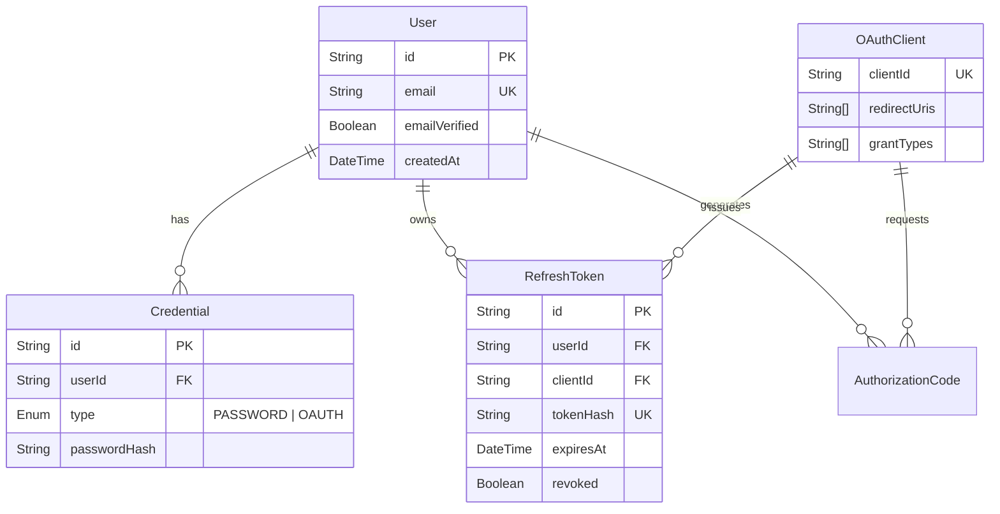
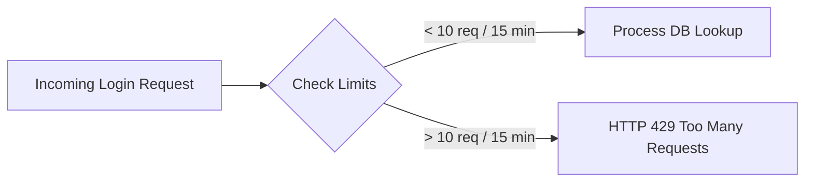

<div align="center">

# 🛡️ AegisID
**The Foundation of Zero-Trust Identity**

[](https://opensource.org/licenses/MIT)
[](#)
[](#)
[](#)
[](#)

AegisID is a production-grade, highly reliable, and deeply secure **Authentication and Authorization Identity Platform**. Built using modern Node.js and strict TypeScript paradigms, it provides centralized identity management, properly implemented OAuth2/OIDC flows, and robust security measures out of the box, functioning as the zero-trust boundary for your microservice domain.

[Documentation](#) • [API Reference](#15-api-documentation) • [Threat Model](#19-threat-model) • [Architecture](#4-system-architecture)

</div>

---

## 2. 🌍 Project Overview

### The Identity Trilemma in Modern Systems
In modern distributed architectures, identity systems often fail at the intersection of **Security, Usability, and Interoperability**. Building centralized identity from scratch usually results in brittle custom mechanics, whereas standard OAuth2/OIDC implementations in enterprise environments frequently suffer from:

1. **Token Sprawl:** Unmanaged token lifecycles leading to massive replay attack vulnerabilities.
2. **Coupled Business Logic:** Tying user identity directly to product databases instead of a centralized, isolated Identity Provider (IdP).
3. **PKCE Failures:** Mishandling the Authorization Code flow for single-page applications.

### The AegisID Approach
AegisID is engineered to solve these architectural bottlenecks. By utilizing a hybrid system backed by PostgreSQL for persistence and Redis for ephemeral state (OAuth flows), AegisID ensures high security and performance. It serves as an isolated Identity Provider and Authorization Server, segregating all cryptographic and security boundaries away from upstream business logic. Downstream services merely verify asymmetric signatures.

---

## 3. 🎯 Core Capabilities

AegisID provides comprehensive identity coverage tailored for API-driven environments:

*   **OAuth2.0 Authorization Server:** Full support for Authorization Code (with PKCE) and Refresh Token grants.
*   **OpenID Connect (OIDC) Provider:** Standardized `id_token` issuance, discovery (`/.well-known/openid-configuration`), and UserInfo endpoints.
*   **Asymmetric JWT Lifecycle Management:** RS256 signed JWTs enabling upstream services to verify tokens completely statelessly.
*   **Opaque Refresh Tokens:** SHA-256 hashed refresh tokens persisted securely in the database for session continuity.
*   **Defense-in-Depth Security:** Built-in strict route-based memory rate limiting and brute-force protections.
*   **Centralized Identity:** Single source of truth for user credentials, decoupled from application-specific databases.
*   **Telemetry Ready:** Fully instrumented with OpenTelemetry for distributed microservice tracing.

---

## 4. 🏛️ System Architecture

AegisID is designed as a standalone boundary service. It absorbs all identity-related computational overhead (hashing, signing, validation) leaving downstream services to perform simple, low-latency asymmetric cryptographic signature verifications.



### Architectural Principles
*   **Stateless Verification:** Downstream services verify tokens statelessly using public keys exposed via the JWKS endpoint.
*   **Strict Domain Bounds:** Identity credentials (passwords, salts) live entirely within the Aegis PostgreSQL DB.
*   **Ephemeral State Offloading:** Redis handles ultra-fast read/writes for 5-minute time-to-live OAuth state codes, preventing DB bloat.

---

## 5. 🧩 Component Architecture

The internal architecture strictly adheres to a modular, service-oriented structure.

| Layer | Responsibility | Key Mechanics |
| :--- | :--- | :--- |
| **Route Layer** | HTTP parsing, routing, rate limiting. | Express.js routers and middleware. |
| **Validator Layer** | Input sanitization and payload checking. | Zod schema validation ensuring strict type-safety. |
| **Service Layer** | Core business logic, OAuth state machine, JWT generation. | Centralized TS classes (Auth, OAuth, Telemetry). |
| **Repository Layer** | Database abstraction, relational integrity. | Prisma ORM with generated strictly-typed schemas. |
| **Cache Layer** | Short-lived OAuth flow state management. | `ioredis` for ultra-fast Key-Value TTL storage. |
| **Crypto Layer** | Asymmetric generation and hashing. | `bcrypt`, `jose` for RS256 JWTs, Node `crypto`. |

---

## 6. 🔄 Request Lifecycle

Let's dissect the exact system flow of a standard user login and PKCE token exchange request mapping deeply into the system's memory.



---

## 7. 🔐 OAuth2 Flows

AegisID implements modern OAuth2.0 flows optimized for high-security environments.

### Authorization Code Flow with PKCE
Designed natively to prevent authorization code interception, mandatory for both mobile and single-page applications.



### Refresh Token Grant
When a short-lived Access Token expires (15m), the client uses the persistent Refresh Token to obtain a new pair, securely orchestrated via database revocation flags.

---

## 8. 🆔 OpenID Connect (OIDC) Integration

AegisID natively supports OpenID Connect standards for federated application mapping.

*   **Discovery Endpoint:** Exposes `/.well-known/openid-configuration` revealing issuer URIs and supported algorithms.
*   **JWKS Endpoint:** Upstream microservices pull the RSA public keys from `/.well-known/jwks.json` to verify the digital signatures on access and id tokens.
*   **The `id_token`:** A strict RS256 JWT meant for the client application containing authenticated assertions (`sub`, `email`, `name`).
*   **UserInfo:** The `/userinfo` endpoint allows resource servers to fetch profile data dynamically.



---

## 9. ⏳ Token Lifecycle & Cryptography

All cryptographic operations are handled purely via Node's Native Crypto and heavily vetted libraries.

1.  **Generation:** Access tokens and ID tokens are signed using **RSA (RS256)** via the `jose` library. This asymmetric signing requires AegisID to hold the Private Key, while any service globally can verify the signature using the Public Key.
2.  **Access Token State:** Access tokens are strictly stateless and live for exactly **15 minutes**.
3.  **Refresh Token State:** Highly random UUIDs are generated, hashed using SHA-256 natively, and stored in PostgreSQL. The client holds the plain-text UUID, which it exchanges.

---

## 10. ⚡ Redis Design

AegisID uses Redis strategically to offload ephemeral state from the relational database, ensuring maximum throughput during authentication bursts.



*   **OAuth Authorization Codes:** Stored as `string` key-value pairs (`auth_code:{code}`) holding the related `clientId`, `userId`, and PKCE `codeChallenge`. They strict-expire via Redis `EX` TTL constraints.

---

## 11. 🗄️ Database Design

PostgreSQL acts as the unbreakable system of record. The schema is highly normalized using Prisma.



---

## 12. 🛡️ Authorization Architecture

AegisID utilizes granular OAuth client verification rules alongside the core identity.

*   **Client Segmentation:** Access tokens are strictly scoped to the exact `clientId` via the `audience` claim.
*   **Refresh Targeting:** Token revocation specifically updates the database flag (`revoked: true`) targeting the junction of `userId` & `clientId`.

---

## 13. 🔒 Security Architecture

Security is integrated deeply into the memory execution layers.

| Vector | Mitigation Strategy | Implementation Details |
| :--- | :--- | :--- |
| **Credential Theft** | Cryptographic Hashing | `bcrypt` (Salt Rounds: 9) ensuring massive resistance against dictionary attacks. |
| **Token Replay** | Short Lived Tokens | Access tokens definitively expire in 15m. |
| **Timing Attacks** | Constant-time Hashing | Node crypto `sha256` hashing utilized for all PKCE verifier validations. |
| **Database Bloat** | Ephemeral Cache | Temporary codes live in Redis and are destroyed instantly upon use or timeout. |
| **Input Exploits** | Strict Zod Guardrails | Fully typed TypeScript + Zod parse/throw mechanics reject malformed JSON directly at the Express middleware boundary. |

---

## 14. ⏱️ Rate Limiting Design

A brute-force attack on an authentication endpoint can bottleneck the Event Loop and database. AegisID mitigates this natively using memory-based Rate Limiters.


*   **Global Limits:** 100 requests / 15 minutes globally.
*   **Strict Auth Limits:** (Login & Token Exchange) 10 requests / 15 minutes window to severely limit credential-stuffing bots.

---

## 15. 📖 API Documentation

AegisID adheres to strict RESTful standards and intuitive contract design. All payloads are `application/json`.

| HTTP Method | Endpoint | Description | Layer |
| :--- | :--- | :--- | :--- |
| `POST` | `/auth/register` | Creates a new user identity & bcrypt hash. | Identity |
| `POST` | `/auth/login` | Authenticates and initiates state (Auth Code). | Identity |
| `POST` | `/oauth/token` | Exchanges Auth Code or Refresh Token for JWTs. | OAuth |
| `GET` | `/.well-known/openid-configuration` | Standard discovery endpoint. | OIDC |
| `GET` | `/.well-known/jwks.json` | Exposes RS256 Public Keys for microservices. | OIDC |
| `GET` | `/userinfo` | Endpoint for token-derived user asserts. | OIDC |

### Example Request (`/oauth/token`) Exchanging PKCE
```http
POST /oauth/token HTTP/1.1
Content-Type: application/json

{
  "code": "8e3c-4b...",
  "codeVerifier": "mJq25l_...",
  "clientId": "client-uuid"
}
```

### Example Response (`200 OK`)
```json
{
  "accessToken": "eyJhbG...",
  "idToken": "eyJhbG...",
  "refreshToken": "fb32a-..."
}
```

---

## 16. 💥 Error Handling & Telemetry

AegisID utilizes strict error routing and full instrumentation.

*   **Error Middleware:** All thrown exceptions fall through to a strictly typed Error Handler, returning safe, sanitized error payloads without leaking database configurations.
*   **OpenTelemetry:** Configured completely utilizing `@opentelemetry/auto-instrumentations-node` and `exporter-trace-otlp-http`, pushing spans for all DB lookups, Express routes, and outgoing requests.

---

## 17. 📁 Project Structure

Designed for enterprise-level maintainability.

```text
├── keys/                # Private & Public RSA PEM keys
├── prisma/              # Schema declarations and Migrations
├── src/
│   ├── cache/           # Redis ioredis client configurations
│   ├── config/          # Environment variable bindings
│   ├── db/              # Prisma client singletons
│   ├── middleware/      # Rate limits, Error boundaries
│   ├── routes/          # Express route declarations (auth, oauth, wellknown)
│   ├── services/        # Core logic (auth.service, jwks.service, oauth.services)
│   ├── telemetry/       # OpenTelemetry bindings
│   ├── utils/           # JWT verifications and signers
│   └── validators/      # Zod DTO schema validations
└── package.json         # Node constraints and dependencies
```

---

## 18. 🚀 Performance Optimization

Designed for Node.js V8 execution speed:

1.  **RS256 Private Key Caching:** Keys are loaded via `readFileSync` directly at module startup into memory, preventing disk IO upon token generation.
2.  **Connection Pooling:** Prisma utilizes connection strategies for PostgreSQL optimizations.
3.  **No ORM Overhead on Transients:** Temporary states bypass the ORM and go directly to Redis.

---

## 19. 🕵️ Threat Model

Built under the assumption that the upstream boundary is hostile.

| Threat | System Defense |
| :--- | :--- |
| **Credential Stuffing** | Strict 10req/15min rate limits on `/auth/login` to prevent bulk automated testing. |
| **Database Exfiltration** | Passwords hashed via Bcrypt (cost 9), computationally expensive to reverse offline. |
| **Token Modification** | RSA asymmetric verification guarantees payload integrity. |
| **PKCE Replay Attack** | Temporary Auth Codes expire inside Redis, avoiding lingering state. |

---

## 20. 🔌 Extensibility & Scalability

AegisID is built purely stateless on the Express tier:
*   **Horizontal Scale:** Because rate limits are memory-based and Redis handles cross-node state, spinning up massive parallel Node instances requires zero code changes.
*   **Easy OIDC Adoption:** New microservices simply scrape the URL `/.well-known/jwks.json` and immediately inherit secure authentication verification capabilities.

---

## 21. 🛣️ Future Roadmap

- [ ] **Redis Rate Limiting:** Transitioning `express-rate-limit` to utilize a Redis store for distributed rate locking across multiple pod instances.
- [ ] **JWT Blacklist Implementation:** Pushing revoked Access Token `jti` to Redis for absolute synchronous token invalidation before the 15m expiration.
- [ ] **Role-Based Access Control (RBAC):** Implementing relational `Role` and `Permission` matrices within Prisma.

---

## 22. 👨‍💻 Author

**Designed and Engineered by [Ayush Raj]**  
*Staff Software Engineer / System Architect*  

<br/>

<div align="center">
  <i>If you found this architecture documentation valuable, consider giving it a ⭐.</i>
</div>
