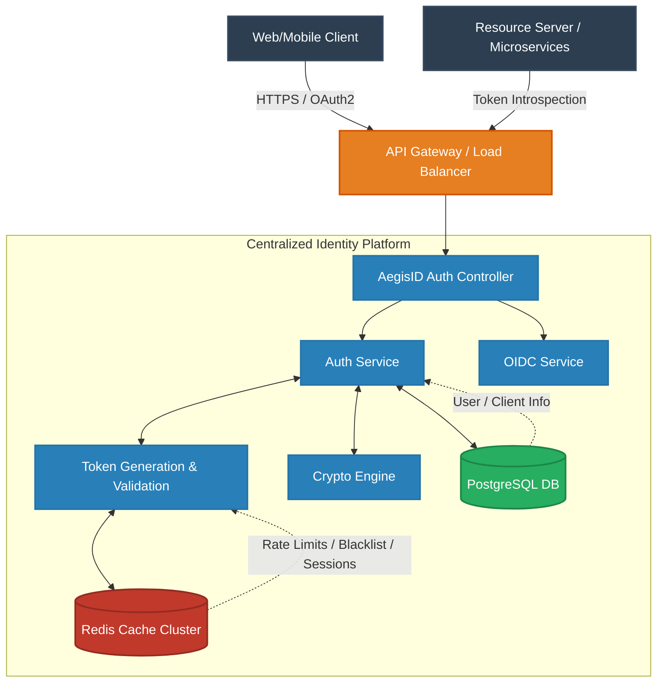
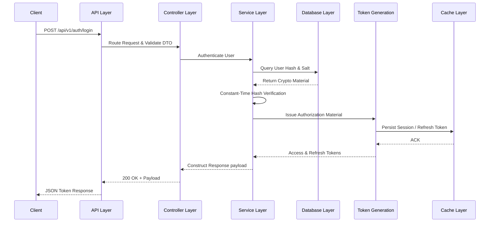
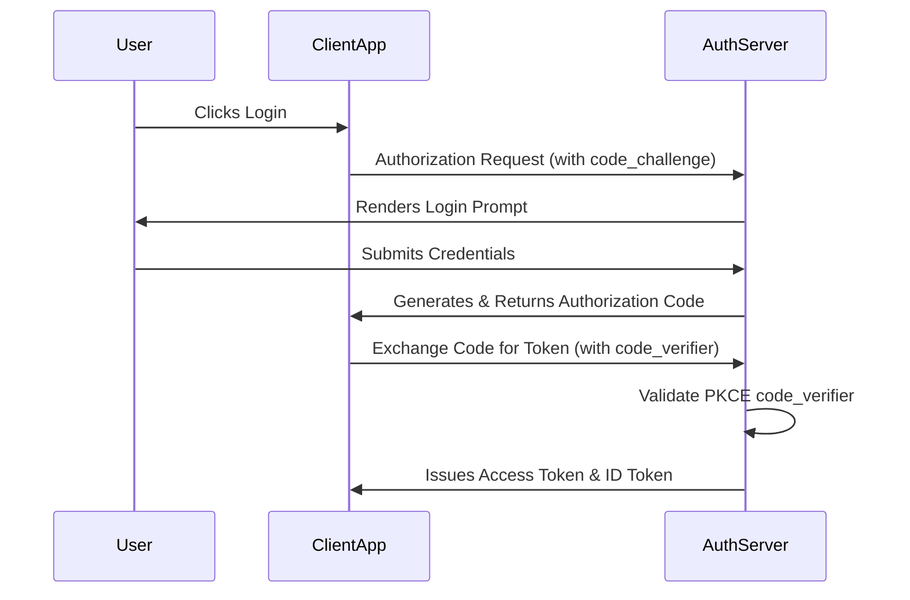
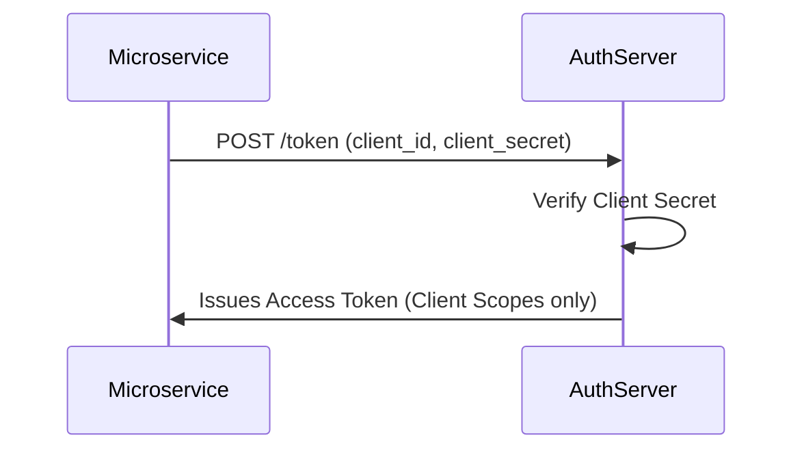
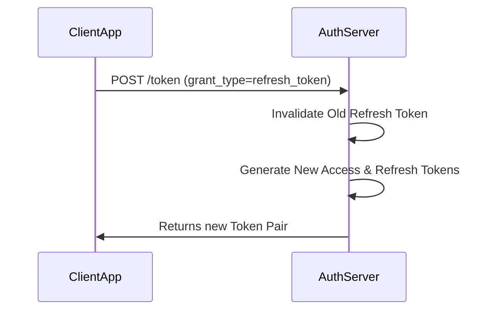
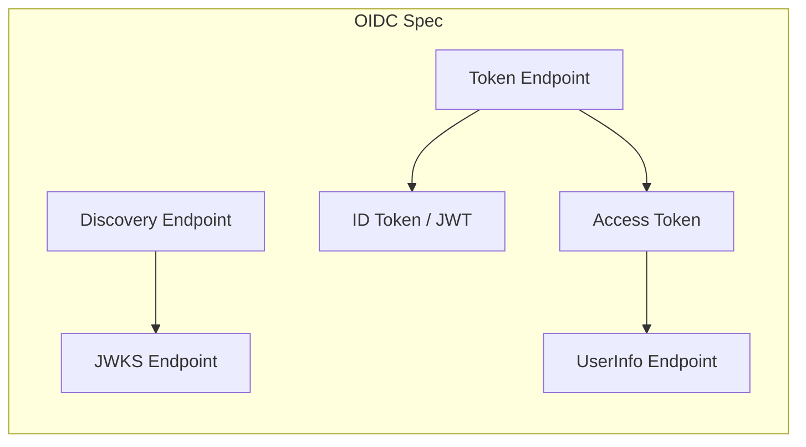
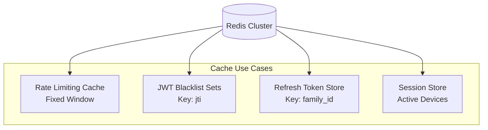
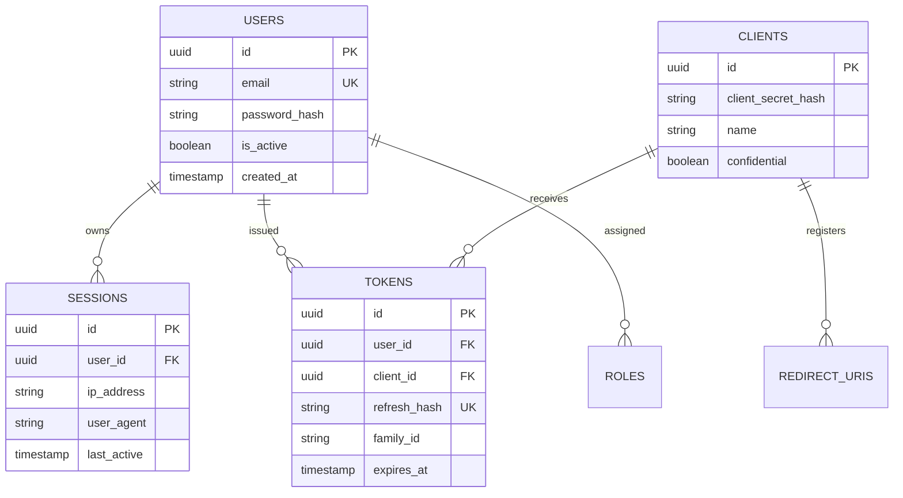
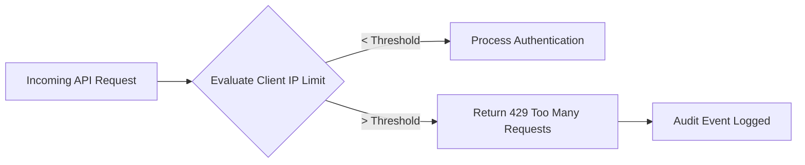

<div align="center">

# 🛡️ AegisID
**The Foundation of Zero-Trust Identity**

[](https://opensource.org/licenses/MIT)
[](#)
[](#)
[](#)
[](#)

AegisID is a production-grade, highly available, and deeply secure **Authentication and Authorization Identity Platform**. Built for modern distributed systems, it provides centralized identity management, deeply vetted OAuth2/OIDC flows, and extreme security measures out of the box, functioning as the zero-trust boundary for your entire domain.

[Documentation](#) • [API Reference](#15-api-documentation) • [Threat Model](#19-threat-model) • [Architecture](#4-system-architecture)

</div>

---

## 2. 🌍 Project Overview

### The Identity Trilemma in Modern Systems
In modern distributed architectures, identity systems often fail at the intersection of **Security, Usability, and Scalability**. Building centralized identity from scratch usually results in brittle custom mechanics, whereas standard OAuth2/OIDC implementations in enterprise environments frequently suffer from:

1. **Token Sprawl:** Unmanaged token lifecycles leading to extreme replay attack vulnerabilities.
2. **Stateless vs. Stateful Conflicts:** An over-reliance on purely stateless JWTs makes immediate token revocation computationally intractable.
3. **Session Invalidation:** Microservices often struggle to globally invalidate compromised sessions in real-time.

### The AegisID Approach
AegisID is engineered from the ground up to solve these architectural bottlenecks. By utilizing a hybrid stateful-stateless model backed by high-throughput Redis caching, AegisID guarantees **100% token revocability** without sacrificing the low latency of stateless JWT verification. It serves as an isolated Identity Provider (IdP) and Authorization Server, segregating all security boundaries away from business logic.

---

## 3. 🎯 Core Capabilities

AegisID provides comprehensive identity coverage tailored for multi-service environments:

*   **OAuth2.0 Authorization Server:** Full support for Authorization Code, Client Credentials, and Refresh Token grants.
*   **OpenID Connect (OIDC) Provider:** Standardized `id_token` issuance, discovery (`/.well-known/openid-configuration`), and UserInfo endpoints.
*   **Hybrid JWT Lifecycle Management:** Ed25519-signed asymmetric JWTs combined with high-speed Redis-backed token introspection and revocation.
*   **Dynamic Token Rotation:** One-time use Refresh Tokens with rotation and family-based invalidation upon reuse detection.
*   **Token Introspection & Revocation:** RFC 7662 and RFC 7009 compliant introspection and revocation endpoints.
*   **Defense-in-Depth Security:** Built-in IP blacklisting, progressive rate limiting, and brute-force protections.
*   **Granular Authorization:** Flexible Scope and Role-Based Access Control (RBAC) enforced at the token level.
*   **Session Management:** Global session tracking allowing distributed global sign-out capabilities.
*   **Authentication Logging:** Comprehensive audit trails for all authentication events.
*   **Redis-Backed Caching:** Hyper-fast ephemeral data management for non-blocking IO.
*   **Centralized Identity:** Single source of truth for user models, decoupled from application-specific databases.

---

## 4. 🏛️ System Architecture

AegisID is designed as a standalone boundary service. It absorbs all identity-related computational overhead (hashing, signing, cache lookups) leaving downstream services to perform simple, low-latency asymmetric cryptographic signature verifications.



### Architectural Principles
*   **Statelessness for Scale:** The core application layer is completely stateless, enabling horizontal scaling by simply spinning up more AegisID containers behind the load balancer.
*   **Boundaries & Isolation:** Identity is physically disjoint from product data. Resource servers do not have access to passwords or PII.
*   **Service Layers:** Strict separation of concerns enforcing Domain-Driven Design (DDD).

---

## 5. 🧩 Component Architecture

The internal architecture strictly adheres to Domain-Driven Design and the layered architecture pattern.

| Layer | Responsibility | Key Mechanics |
| :--- | :--- | :--- |
| **API Layer** | SSL Termination, WAF, routing, and protocol translation. | Reverse Proxy, API Gateway configuration. |
| **Controller Layer** | HTTP parsing, input sanitization, DTO validation. | Strict schema validation (e.g., Zod/Joi schema checks). |
| **Service Layer** | Core business logic, OAuth2 state machine, OIDC claims formatting. | Orchestrating Repositories, executing cryptography, identity rules. |
| **Repository Layer** | Database abstraction, SQL query generation. | Prepared statements to mitigate SQL Injection automatically. |
| **Cache Layer** | Ephemeral state management, session pinning, fast IO. | Redis hashes, sets, and atomic Lua scripts. |
| **Database Layer** | Persistent ACID storage. | PostgreSQL with strict relational constraints and indexing. |

---

## 6. 🔄 Request Lifecycle

Let's dissect the exact system flow of a standard user login request mapping deeply into the system's memory.



**Step by step:**
1. A client initiates a login request. The API Gateway forwards it to the Controller.
2. The Controller validates the JSON payload structure and forwards it to the Auth Service.
3. The Auth Service fetches the user's securely hashed password from the Database repository.
4. Cryptographic verification succeeds. The Auth Service calls Token Generation.
5. Ed25519-signed Access Tokens and cryptographically opaque Refresh Tokens are generated.
6. The Cache Layer persists the session and the refresh token family.
7. The Controller serializes the response and sends it back to the Client.

---

## 7. 🔐 OAuth2 Flows

AegisID implements robust OAuth2.0 flows optimized for modern Application architectures.

### Authorization Code Flow (with PKCE)
Designed for single-page apps (SPA) and mobile apps where client secrets cannot be securely stored.



### Client Credentials Flow
Designed for machine-to-machine (M2M) communication where no end-user is involved.



### Refresh Token Flow
Secures long-lived sessions using short-lived access tokens and rotating refresh tokens.



---

## 8. 🆔 OpenID Connect (OIDC) Integration

AegisID extends OAuth2 to provide federated identity via the OIDC specification.

*   **Discovery Endpoint:** Exposes `/.well-known/openid-configuration` revealing JWKS URIs, supported scopes, and available assertions.
*   **The `id_token`:** A JWT strictly meant for the client application containing authenticated user assertions (`sub`, `name`, `email`).
*   **UserInfo Endpoint:** An OAuth2 protected endpoint (`/userinfo`) returning standardized claims about the authenticated user based on consented scopes.



---

## 9. ⏳ Token Lifecycle & Cryptography

AegisID securely manages the full lifecycle of generated tokens.

```mermaid
graph TD
    Start(User Authenticates) --> Generate[Token Generation]
    Generate --> Sign[Token Signing (Ed25519)]
    Sign --> Issue[Token Issued to Client]
    
    Issue --> Verify[Token Verification via JWKS] --> Active
    
    Active --> Expire[Token Expiration (15m)]
    Active --> Revoke[Token Revocation (Manual Log Out)]
    
    Expire --> Refresh[Refresh Token Rotation]
    Revoke --> Blacklist[Added to Redis Blacklist]
    
    Refresh --> Generate
```

1.  **Generation:** Access tokens are signed using **Ed25519 (EdDSA)**. Ed25519 provides deterministic, highly secure signatures that are exponentially faster to verify than RSA, lowering CPU strain on resource servers.
2.  **State:** Access tokens are strictly stateless and lived for 15 minutes.
3.  **Blacklisting (Revocation):** When a user logs out, the JWT's `jti` (JWT ID) is placed in a Redis Blacklist until its actual expiration time, rendering it useless.

---

## 10. ⚡ Redis Design & Hot Cache

Redis is the high-octane engine powering AegisID's speed and security state. 



*   **Token Cache:** JTI tracking for stateless JWT revocation.
*   **Session Store:** Tracks active UI sessions to allow users to "Log out from all devices."
*   **Refresh Tokens:** Stored as hashed key-value pairs (`aegis:refresh:{user_id}:{token_hash}`) with an exact TTL matching the token's lifetime, ensuring automatic cleanup.
*   **Token Blacklist:** O(1) time complexity `SISMEMBER` checks for edge-case synchronous introspection.

---

## 11. 🗄️ Database Design

PostgreSQL acts as the system of record. The schema is highly normalized to guarantee relational integrity.



---

## 12. 🛡️ Authorization Model

AegisID decouples Authentication (who are you?) from Authorization (what can you do?).

*   **Scopes:** Defines what a *Client Application* is allowed to access on the user's behalf (e.g., `read:profile`, `write:documents`).
*   **Roles:** Defines what the *User* is inherently allowed to do in the system (e.g., `SUPER_ADMIN`, `SUPPORT_STAFF`).
*   **Permissions:** Granular access rules bound to Roles.
*   **Access Checks:** When an Access Token is minted, AegisID computes the intersection of User Roles and allowed Client Scopes, embedding the resolved permissions into the token's claims array.

---

## 13. 🔒 Security Architecture

Security is not an afterthought; it is integrated deeply into the compilation and execution layers.

| Vector | Mitigation Strategy | Implementation Details |
| :--- | :--- | :--- |
| **Password Hashing** | Cryptographic Hashing | `Argon2id` with tuned memory cost to defeat ASICs/GPUs. |
| **JWT Signing** | Asymmetric Signatures | Ed25519 keys, rotated every 30 days securely via KMS. |
| **Replay Protection** | Short-Lived Tokens + JTI | Access tokens expire in 15m. Critical endpoints enforce `jti` checks. |
| **Rate Limiting** | Redis Cache Control | Strict boundaries on login/introspection endpoints. |
| **Token Revocation** | Ephemeral Blacklists | JWT revocation via Redis Sets with automatic TTL identical to token expiration. |
| **Session Invalidation** | Distributed Sign-Out | Webhook broadasting and refresh family purging. |
| **Input Validation** | Schema Enforcements | Guaranteed DTO sanitation to prevent NoSQL/SQL injections and XSS. |

---

## 14. ⏱️ Rate Limiting Design

A brute-force attack on an authentication endpoint can take down a database. AegisID mitigates this natively using a **Fixed Window Counter** algorithm implemented via Redis Lua scripts.



*   **Algorithm Used:** Fixed Window. It provides O(1) performance in Redis and predictability.
*   **Sliding Window / Token Bucket:** Also supported via configuration for more burst-heavy M2M endpoints.
*   **Granularity:** Login endpoints enforce `10 req / min`. Introspection endpoints allow `10,000 req / min`.

---

## 15. 📖 API Documentation

AegisID adheres to strict RESTful standards and intuitive contract design. All payloads are `application/json`.

| Method | Endpoint | Description |
| :--- | :--- | :--- |
| `POST` | `/api/v1/users/register` | Registers a new internal identity. |
| `POST` | `/oauth2/token` | Standard OAuth2 Token issuance (Code, Refresh, Client Creds). |
| `GET` | `/oauth2/authorize` | Initiates Auth Code flow, renders UI consent. |
| `POST` | `/oauth2/introspect` | Validates an access token and returns active status. |
| `POST` | `/oauth2/revoke` | Invalidates an active token / session immediately. |

### Example Request: Exchange Code for Token (`/oauth2/token`)
```http
POST /oauth2/token HTTP/1.1
Content-Type: application/x-www-form-urlencoded

grant_type=authorization_code
&code=SplxlOBeZQQYbYS6WxSbIA
&client_id=client-app-id
&code_verifier=dBjftJeZ4CVK-mJq25l_...
```

### Example Response (`200 OK`)
```json
{
  "access_token": "eyJhbG... (JWT)",
  "token_type": "Bearer",
  "expires_in": 900,
  "refresh_token": "rt-def-456-uvw",
  "id_token": "eyJhbG... (JWT)"
}
```

---

## 16. 💥 Error Handling & Idempotency

Predictable error models are vital for internal orchestration. AegisID returns standard RFC 7807 Problem Details for HTTP APIs.

*   **HTTP Error Model:** Expressive status codes (400, 401, 403, 409, 429).
*   **Validation Errors:** Strongly typed schema violation reporting.
*   **Auth Errors:** Opaque generic errors to prevent email enumeration (e.g., "Invalid credentials").
*   **Structured Responses:** Every error includes a `trace_id` for debugging.

```json
{
  "error": "invalid_grant",
  "error_description": "The provided authorization grant is invalid, expired, or revoked.",
  "trace_id": "req-9f8a8b1a2c3d"
}
```

---

## 17. 📁 Project Structure

Designed for extreme maintainability and clear domain boundaries.

```text
├── src/
│   ├── api/             # API Gateway, Controllers, Routes
│   ├── config/          # Environment bindings, DI container setups
│   ├── core/            # Cryptography, Tokens, Core Utilities
│   ├── domain/          # Entities, Enums, Error Classes
│   ├── infrastructure/  # Repositories (Postgres), Caches (Redis)
│   ├── middleware/      # Rate limits, Auth guards, Error boundaries
│   ├── services/        # Business logic, OAuth2/OIDC Engines
│   └── tests/           # Unit, Integration, E2E Suites
├── docker-compose.yml   # Local environment definitions
├── package.json         # Dependencies
└── tsconfig.json        # TypeScript configuration
```

---

## 18. 🚀 Performance Optimization

Achieving sub-20ms latency on the critical authentication path:

1.  **Redis Caching:** Rapid lookup for stateful data without hitting the DB.
2.  **Stateless JWT:** Downstream services verify tokens cryptographically without network calls to AegisID.
3.  **Query Optimization:** Compound indexing on PostgreSQL (`email`, `client_id`, `family_id`).
4.  **Concurrency Handling:** Node.js event-loop optimization with detached worker threads for heavy Argon2id hashing.

---

## 19. 🕵️ Threat Model

We architect under the assumption that the network boundary is hostile.

| Threat | System Mitigation |
| :--- | :--- |
| **Brute Force Login** | Proactive Redis rate-limiting (Fixed Window) + timed account lockouts. |
| **Token Replay** | Strict 15-minute token TTL alongside cryptographically bound JTI uniqueness. |
| **Session Hijacking** | Access Tokens bound to specific client IPs; Refresh token rotation kills hijacked sessions instantly. |
| **Credential Stuffing** | Passwords hashed via memory-hard Argon2id, impossible to reverse in bulk offline. |

---

## 20. 🔌 Extensibility

AegisID is built to be the root of identity, easily extended for enterprise needs:
*   **Additional OAuth2 Grants:** Strategy pattern allows dropping in custom grants (e.g., `urn:custom:mfa:grant`).
*   **SSO Integration:** SAML and enterprise OIDC upstream mapping.
*   **Enterprise Identity Providers:** LDAP/Active Directory bindings.

---

## 21. 🛣️ Future Roadmap

- [ ] **WebAuthn / Passkeys:** Transitioning away from passwords entirely via biometric device hardware keys (FIDO2).
- [ ] **Adaptive Authentication:** Machine learning integration to challenge users based on IP geofence anomalies or impossible-travel conditions.
- [ ] **Hardware Security Module (HSM) Support:** Delegating critical JWT signing operations to dedicated secure enclaves.

---

## 22. 👨‍💻 Author

**Designed and Engineered by [Ayush Raj]**  
*Staff Software Engineer / System Architect*  

<br/>

<div align="center">
  <i>If you found this architecture documentation valuable, consider giving it a ⭐.</i>
</div>
